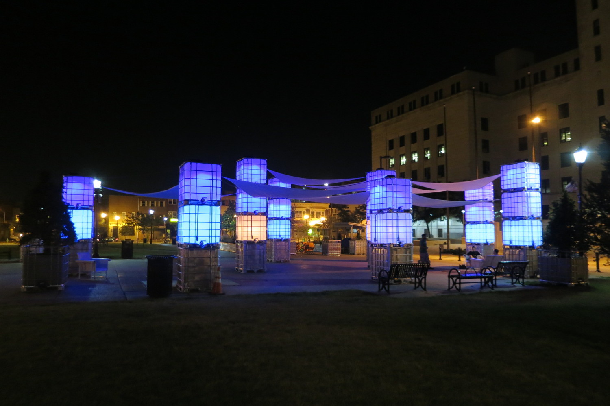
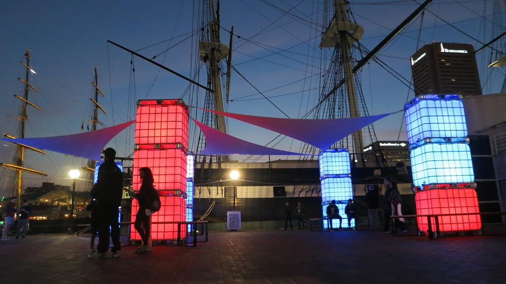
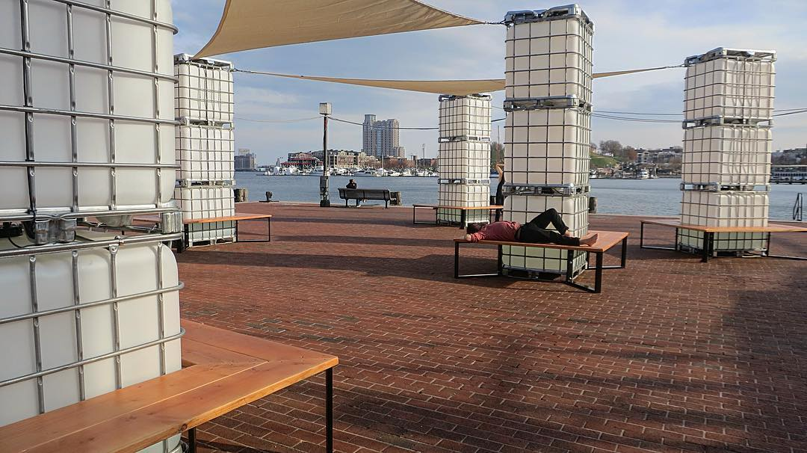
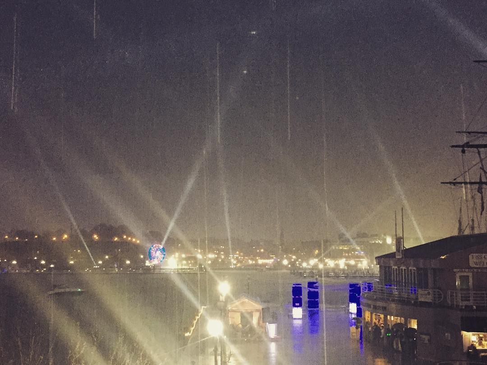

# Background #

Blue Hour was originally designed for a 3 month installation in Camden, New Jersey, USA, in January of 2014. The work was inspired by the Kubik series of installations by Balestra Berlin. Blue Hour used NeoPixel LED strips wrapped around PVC cylinders to light up towers of IBC totes. The lights in the upper totes were just spotlights set to blue. The bottom tote of each tower contained LED strips that started blue, but when PIR sensors were triggered by a person nearby, they changed to orange. After the person left, the cube faded back to blue. The LED strips were controlled by an Arduino mounted under the cap of each bottom tote.

# Light City Baltimore #

The second Blue Hour installation happened on March 28 - April 3, 2016 at Light City Baltimore, "the first large-scale international light festival in the United States," according to the organizers.

Here's what the installation looked like. There were 6 towers of 3 cubes each. Each cube had 4 PIR motion sensors and a brain that monitored the sensors and changed the color of the cubes.

The ship in the background is the USS Constellation, built in 1854.

Most of the media coverage showed Blue Hour when lots of people were around, but on one night of the festival, it rained, and the shy robot emerged.

<video controls="controls"><source src="img/blue-hour-baltimore-shy-robot.mp4" type="video/mp4"></video>