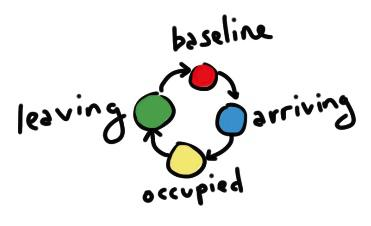
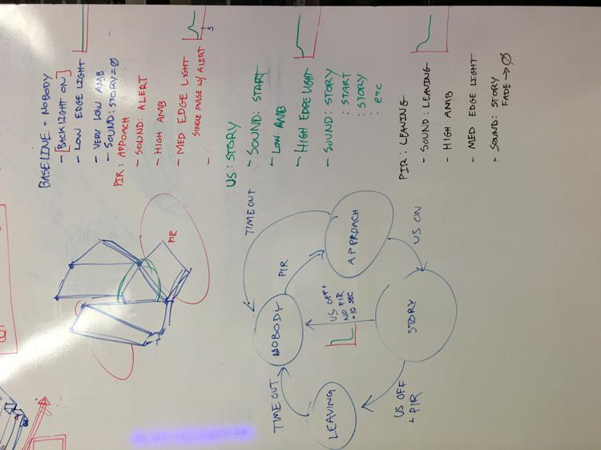

# Notes for tweaking installation #

There are three Teensy's in each of the two installations: the sensor Teensy, the audio Teensy, and the datalogger Teensy. Each runs firmware that needs to be separately compiled from the [source code](https://github.com/newamericanpublicart/ourself)

# About the datalogger #

The datalogger watches three pins and writes to a file called "datalog.txt" on the FAT32-formatted SD card. (This is the default format for most SD cards.) When one or more of the pins are high, it writes lines like this to the datalog:

```
2016-05-12T14:23:01Z,ARR,,
2016-05-12T14:23:02Z,ARR,,
2016-05-12T14:23:03Z,ARR,,
2016-05-12T14:23:04Z,,OCC,
2016-05-12T14:23:05Z,,OCC,
2016-05-12T14:23:06Z,,,DEP
2016-05-12T14:23:07Z,,,DEP
```

With the current state machine running on the sensor Teensy, `ARR` means that the microwave sensors have been triggered, but nobody is on the platform, i.e. it seems like someone has arrived. `OCC` means that someone is occupying the platform. `DEP` means that the platform was recently vacated and the microwave sensors are triggered, i.e. someone is probably departing.

### Warning ###

Don't delete the file "datalog.txt", or if you do, recreate it. If it doesn't exist, no data will be logged and you will be sad.

# State machine in sensor Teensy #

[](img/ourself-state-machine-diagram-2016-05-10.jpg)

[](img/ourself-whiteboard-state-machine-2016-04-14.jpg)

### State machine code ###

This code worked nicely; it could be modified to make whatever state machine you need.

```C
void updateStateMachine(void) {
    static int state = STATE_BASELINE;

    Serial.print("STATE: ");
    Serial.print(state);
    Serial.print("\n");

    switch(state) {
        case STATE_BASELINE:
            setLightsTarget(25); // set edge lights to low
            // by default, ambient sound will be very low
            digitalWrite(AUD1, LOW);
            digitalWrite(AUD2, LOW);
            digitalWrite(AUD3, LOW);
            if(motionDetected() || personBetweenMirrors()) {
                state = STATE_APPROACH;
            }
            break;
        case STATE_APPROACH:
            setLightsTarget(100);
            digitalWrite(AUD1, HIGH);
            digitalWrite(AUD2, LOW);
            digitalWrite(AUD3, LOW);
            if(personBetweenMirrors()) {
                state = STATE_STORY;
            } else if(!motionDetected()) {
                state = STATE_BASELINE;
            }
            break;
        case STATE_STORY:
            digitalWrite(AUD1, LOW);
            digitalWrite(AUD2, HIGH);
            digitalWrite(AUD3, LOW);
            setLightsTarget(255); // set edge light to high
            if(!personBetweenMirrors()) {
                if(motionDetected()) {
                    state = STATE_LEAVING;
                } else {
                    // need a timeout in here?
                    state = STATE_BASELINE; // this is the case where the person vanished without tripping the PIR
                }
            }
            break;
        case STATE_LEAVING:
            digitalWrite(AUD1, LOW);
            digitalWrite(AUD2, LOW);
            digitalWrite(AUD3, HIGH);
            setLightsTarget(100); // set edge lights to medium
            if(personBetweenMirrors()) { // ah, they went back in!
                state = STATE_STORY;
            }
            if(!motionDetected()) { // may also want a timeout in here
                state = STATE_BASELINE;
            }
            break;
    }
}
```


